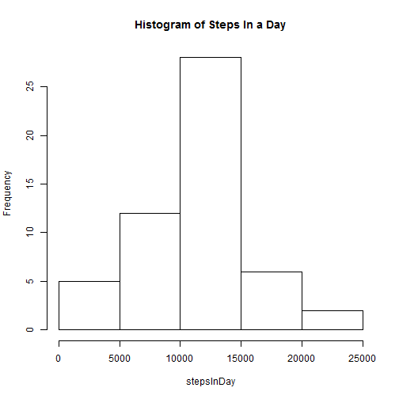

---
title: "PA1_template.Rmd"
author: "Geetika Jain"
date: "Monday, March 16, 2015"
output: html_document
---

This is an R Markdown document for Peer Assessment 1 of "Reproducible Research" course from coursera


```r
## Read the data
rawData = read.csv("activity.csv", header = T)
data  = rawData[complete.cases(rawData), ]

## Load the requisite libraries
library(plyr)
```

```
## 
## Attaching package: 'plyr'
## 
## The following object is masked from 'package:lubridate':
## 
##     here
```

```r
library(ggplot2)

## Create new DF with no. of steps for each day
plotData = ddply(data, .(date), summarise, stepsInDay = sum(steps, na.rm = T))

## Plot the data
##qplot(data = plotData, x = stepsInDay, geom = "histogram", stat = "identity")
hist(plotData$stepsInDay, xlab = "stepsInDay", 
     main = "Histogram of Steps In a Day")
```

 
Summary of the  data

```r
summary(plotData)
```

```
##          date      stepsInDay   
##  2012-10-02: 1   Min.   :   41  
##  2012-10-03: 1   1st Qu.: 8841  
##  2012-10-04: 1   Median :10765  
##  2012-10-05: 1   Mean   :10766  
##  2012-10-06: 1   3rd Qu.:13294  
##  2012-10-07: 1   Max.   :21194  
##  (Other)   :47
```


Computing the mean and the meadian of the data

```r
mean(plotData$stepsInDay)
```

```
## [1] 10766.19
```

```r
median(plotData$stepsInDay)
```

```
## [1] 10765
```

Computing average number of steps in an interval

```r
## Create DF with number of steps in an interval averaged over all days
intervalMean = ddply(data, .(interval), summarise, meanStepsInInterval = mean(steps))

## Plot a line graph for the trend
qplot(data = intervalMean, x = interval, y = meanStepsInInterval, geom = "line", stat = "identity")
```

 


The interval with max mean steps averaged across days

```r
intervalMean[which.max(intervalMean$meanStepsInInterval),]
```

```
##     interval meanStepsInInterval
## 104      835            206.1698
```

Number of missing cases

```r
sum(is.na(rawData))
```

```
## [1] 2304
```

Impute missing values : Use the mean steps for that interval averaged across all days

```r
## make a copy of the rawData
workingData = rawData
str(workingData)
```

```
## 'data.frame':	17568 obs. of  3 variables:
##  $ steps   : int  NA NA NA NA NA NA NA NA NA NA ...
##  $ date    : Factor w/ 61 levels "2012-10-01","2012-10-02",..: 1 1 1 1 1 1 1 1 1 1 ...
##  $ interval: int  0 5 10 15 20 25 30 35 40 45 ...
```

```r
## use mean steps for that interval averaged across all days where data is not available
workingData$imputedSteps = apply(workingData[,c('steps', 'interval')], 1, function(x) {if(is.na(x[1]))  intervalMean[which(intervalMean$interval == x[2]), 2]  else x[1]})

str(workingData)
```

```
## 'data.frame':	17568 obs. of  4 variables:
##  $ steps       : int  NA NA NA NA NA NA NA NA NA NA ...
##  $ date        : Factor w/ 61 levels "2012-10-01","2012-10-02",..: 1 1 1 1 1 1 1 1 1 1 ...
##  $ interval    : int  0 5 10 15 20 25 30 35 40 45 ...
##  $ imputedSteps: num  1.717 0.3396 0.1321 0.1509 0.0755 ...
```

```r
qplot(data = workingData, x = date, y = imputedSteps, geom = "histogram", stat = "identity")
```

 

```r
plotData = ddply(workingData, .(date), summarise, stepsInDay = sum(imputedSteps, na.rm = T))

mean(plotData$stepsInDay)
```

```
## [1] 10766.19
```

```r
median(plotData$stepsInDay)
```

```
## [1] 10766.19
```

Observe difference in activity pattern in weekdays vs weekends

```r
data$weekday = apply(data[,2:3], 1, function(x) {if(((weekdays(as.Date(x[1]))) == "Saturday") || (weekdays(as.Date(x[1])) == "Sunday"))  "Weekend"  else  "Weekday"})

intervalMean = ddply(data, .(interval,weekday), summarise, meanStepsInInterval = mean(steps, na.rm = T))

qplot(data = intervalMean, x = interval, y = meanStepsInInterval, facets = weekday ~ . , geom = "line", stat = "identity", xlab = "Interval", ylab = "Number of steps")
```

 


